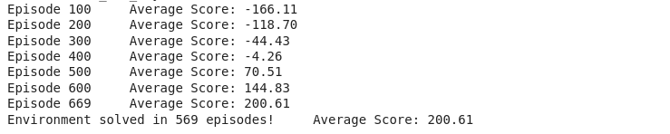

# Deep-Q-Learning-Model-for-Lunar-Landing-Environment

This repository provides a hands-on experience with Deep Q-Learning (DQN) by training an agent to master the challenging Lunar Lander environment. Dive into the code, understand the algorithms, and witness the trained agent's expertise!

## Features:
- Efficient DQN implementation with detailed explanations.
- bWell-organized code separates key components for easy understanding.
- Explore adjustable parameters to customize training.
- Leverage Gym for seamless environment interaction.

[LunarLanding](video.mp4)
